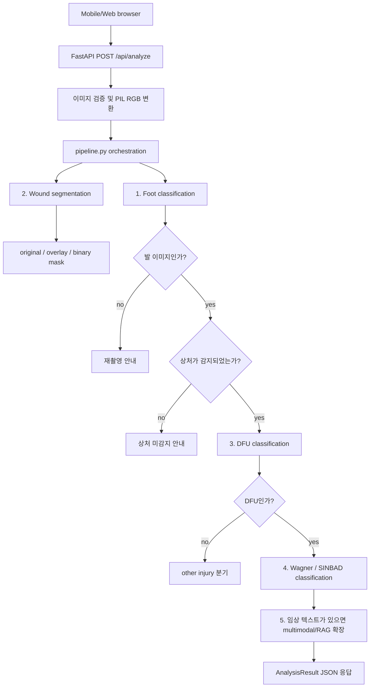

# DFU Project

## 1. 프로젝트 목표

DFU Project는 당뇨병성 족부궤양(Diabetic Foot Ulcer, DFU) 환자가 휴대폰으로 발 또는 상처 이미지를 촬영/업로드하면, 이미지 기반 AI 분석과 선택적 임상 텍스트 입력을 결합해 상처 상태를 확인하는 모바일 우선 서비스다.

현재 1차 목표는 localhost에서 동작하는 웹 형태의 MVP를 완성하는 것이다. 이후 동일한 API/모델 어댑터 구조를 유지한 채 cloud 환경으로 배포할 수 있도록 구성한다.

## 2. 서비스 아키텍처

### 입력
- 이미지: 발 전체, 발 일부, 상처 근접 이미지
- 선택 텍스트: glucose, HbA1c, 메모 등 임상/생활 로그성 데이터

### 추론 흐름


### 핵심 기능
1. Foot classification: 입력 이미지가 발 이미지인지 판단한다.
2. Wound segmentation: 상처 영역을 segmentation하고 original, overlay, binary mask를 반환한다.
3. DFU classification: 상처가 DFU인지 other injury인지 판단한다.
4. Wagner/SINBAD classification: DFU로 판단된 상처의 grade/score를 분류한다.
5. Multimodal 확장: glucose, HbA1c, 메모 등 텍스트 입력과 이미지 분석 결과를 결합해 grade/score 또는 위험도를 보정한다.

## 3. 현재 MVP1 웹 서비스

현재 서비스 앱은 `mvp1_classification` 폴더에 있다. FastAPI 서버가 API와 정적 모바일 웹 화면을 함께 제공한다.

### 실행
```powershell
cd mvp1_classification
pip install -r requirements.txt
uvicorn app.main:app --host 0.0.0.0 --port 8000
```

브라우저에서 `http://localhost:8000`으로 접속한다.

### API
- `GET /`: 모바일 웹 화면 반환
- `GET /health`: 서버 상태 확인
- `POST /api/analyze`: 이미지와 선택 임상 입력을 받아 전체 DFU 분석 파이프라인 실행
- `POST /classify`: 과거 MVP 호환용 단일 classification endpoint

## 4. 폴더와 파일 역할

### 서비스 앱: `mvp1_classification`
- `app/main.py`: FastAPI 엔트리포인트. 정적 파일, `/health`, `/classify`, `/api/analyze` 라우팅과 업로드 이미지 검증을 담당한다.
- `app/schemas.py`: API 응답 스키마. 프론트엔드가 의존하는 계약이므로 기존 필드는 유지하고 필요한 필드만 추가한다.
- `app/settings.py`: 모델 경로, label, backend, threshold, CORS 등 환경변수 기본값을 관리한다.
- `app/model.py`: 과거 `/classify` 호환용 wrapper. 실제 classifier 호출은 `app/services/classifier.py`로 위임한다.
- `app/services/pipeline.py`: foot classification, segmentation, DFU classification, Wagner/SINBAD classification 흐름을 제어한다.
- `app/services/classifier.py`: task별 classifier adapter. `foot`, `dfu`, `wagner`, `sinbad`, `legacy` task를 동일한 인터페이스로 호출한다.
- `app/services/segmentation.py`: wound segmentation adapter. `demo`, `swin_m2f`, `dino_m2f`, `custom_head` backend를 선택할 수 있다.
- `app/image_utils.py`: PIL 이미지를 브라우저에서 표시 가능한 base64 data URL로 변환한다.
- `app/static/index.html`: 모바일 우선 웹 화면.
- `app/static/styles.css`: 반응형 UI 스타일.
- `app/static/app.js`: 이미지 미리보기, `/api/analyze` 호출, 결과 렌더링.
- `requirements.txt`: 로컬 MVP 실행에 필요한 Python 패키지.

### 학습/실험: `Model_training`
- `Model_training/configs/custom/dino_v3_mask2former_wound_instance.yaml`: DINOv3 + Mask2Former wound segmentation config.
- `Model_training/configs/custom/wound_instance_swinb.yaml`: Swin + Mask2Former 계열 segmentation config.
- `Model_training/docs/`: Colab/Kaggle/로컬 학습 가이드.
- `Model_training/notebooks/kaggle_training_dino_m2f.ipynb`: Kaggle 기반 학습 notebook.
- `Model_training/tools/`: dataset 변환 등 보조 스크립트.
- `Model_training/train_net.py`, `Model_training/train_net_freeze.py`: 학습 실행 코드.

### 외부 clone reference
아래 폴더는 GitHub에서 clone한 upstream/reference 코드이며 직접 서비스 코드로 취급하지 않는다.
- `dinov3/`: DINOv3 backbone 원본 reference.
- `DINOv3-Mask2Former/` 또는 `DINOv3-Mask2former/`: DINOv3와 Mask2Former 결합 실험 reference.
- `Mask2formers/`: Mask2Former 원본/참고 구현.

서비스에 필요한 코드는 가능하면 `mvp1_classification/app/services` 아래 adapter로 흡수한다. upstream 폴더를 직접 import하면 배포와 의존성 관리가 어려워지므로, 필요한 부분만 명시적으로 adapter화한다.

### 오케스트레이션 문서
- `orchestration/ORCHESTRATION.md`: sub-agent 또는 작업 분기 운영 규칙.
- `orchestration/agent_registry.yaml`: agent 역할 매핑.
- `orchestration/decision_log.md`: 주요 결정 기록.

## 5. 모델 파라미터 위치

대용량 모델 weight는 Git에 올리지 않고 `parameters/` 아래에 둔다. `parameters/`는 로컬/배포 환경에서 별도로 준비하는 영역으로 취급한다.

권장 구조:
```text
parameters/
  DINOv3_pth/
    dinov3_vitb16_pretrain_lvd1689m-73cec8be.pth
  Mask2Formers_pth/
  Fine-tuned_pth/
    wound_dino_m2f/
      model_final.pth
    wound_segmenter/
      model_final.pth
  app_models/
    foot_classifier.pt
    dfu_classifier.pt
    wagner_classifier.pt
    sinbad_classifier.pt
    legacy_classifier.pt
```

기본 경로는 `app/settings.py`에 정의되어 있다. 폴더를 바꾸고 싶으면 `DFU_PARAMETERS_DIR` 또는 task별 환경변수를 사용한다.

## 6. 모델 교체 방법

### 모델 없이 MVP 화면/API 실행
학습 weight가 아직 없을 때는 기본값으로 동작한다.

```powershell
$env:CLASSIFIER_BACKEND = "dummy"
$env:SEG_DEFAULT_BACKEND = "demo"
uvicorn app.main:app --host 0.0.0.0 --port 8000
```

이 모드에서는 웹 화면과 API 응답 계약을 검증할 수 있지만, 의료적으로 의미 있는 결과는 아니다.

### DINOv3 + Mask2Former segmentation weight 사용
```powershell
$env:SEG_DEFAULT_BACKEND = "dino_m2f"
$env:DINO_M2F_CONFIG_PATH = "C:\path\to\Model_training\configs\custom\dino_v3_mask2former_wound_instance.yaml"
$env:DINO_M2F_WEIGHTS_PATH = "C:\path\to\parameters\Fine-tuned_pth\wound_dino_m2f\model_final.pth"
$env:DINO_WEIGHTS_PATH = "C:\path\to\parameters\DINOv3_pth\dinov3_vitb16_pretrain_lvd1689m-73cec8be.pth"
```

### task별 classifier weight 사용
```powershell
$env:CLASSIFIER_BACKEND = "custom"
$env:CUSTOM_CLASSIFIER = "your_module:YourClassifier"
$env:FOOT_MODEL_PATH = "C:\path\to\parameters\app_models\foot_classifier.pt"
$env:DFU_MODEL_PATH = "C:\path\to\parameters\app_models\dfu_classifier.pt"
$env:WAGNER_MODEL_PATH = "C:\path\to\parameters\app_models\wagner_classifier.pt"
$env:SINBAD_MODEL_PATH = "C:\path\to\parameters\app_models\sinbad_classifier.pt"
```

`CUSTOM_CLASSIFIER`의 class는 `app.services.classifier.BaseClassifier`와 같은 형태로 `load()`와 `predict(image) -> tuple[int, float]`를 구현하면 된다. 이렇게 하면 API와 프론트엔드는 수정하지 않고 모델만 교체할 수 있다.

### custom segmentation adapter 사용
```powershell
$env:SEG_DEFAULT_BACKEND = "custom_head"
$env:CUSTOM_SEGMENTER = "your_module:YourSegmenter"
```

`YourSegmenter.predict(image)`는 `(mask, area_ratio, wound_present)`를 반환해야 한다.

## 7. 수정/확장 원칙

- API 응답 계약은 `app/schemas.py`를 기준으로 관리한다.
- 새 classification task는 `app/services/classifier.py`의 `TASKS`에 추가하고 `pipeline.py`에서 호출 순서를 정의한다.
- 새 segmentation backend는 `app/services/segmentation.py`의 `_BACKEND_FACTORIES`에 adapter를 추가한다.
- 모델 경로, threshold, label은 코드에 하드코딩하지 않고 `app/settings.py`와 환경변수로 관리한다.
- 프론트엔드는 `/api/analyze` 응답만 바라보게 유지한다. 모델 내부 구현이 바뀌어도 화면 코드는 최소 수정으로 유지되어야 한다.
- upstream clone 폴더는 reference로만 사용한다. 서비스 런타임에 직접 의존해야 한다면 별도 adapter와 requirements 정리가 필요하다.
- 의료/진단 문구는 연구/개발용 disclaimer를 유지한다. 실제 임상 사용 전에는 규제, 보안, 로그, 개인정보 정책을 별도로 확정해야 한다.

## 8. Cloud 배포 준비 메모

cloud 배포 전 결정해야 할 항목:
- weight 제공 방식: container image 포함, object storage 다운로드, persistent volume mount 중 선택
- GPU 필요 여부: DINOv3/Mask2Former 실시간 추론이면 GPU 환경 또는 경량화가 필요할 수 있다.
- 모델 warm-up: 첫 요청 latency를 줄이기 위해 startup 시 모델 load를 고려한다.
- 업로드 제한: 이미지 크기, 파일 타입, 요청 timeout, 임시 파일 정책을 명시한다.
- 보안: CORS, 인증, HTTPS, PHI/PII 저장 여부, 로그 마스킹 정책을 확정한다.
- 관측성: request_id, model version, weight path/hash, inference latency를 기록한다.

## 9. 현재 상태

- `mvp1_classification`은 localhost 웹/API 형태로 실행 가능한 구조다.
- 학습 weight가 없을 때는 `dummy` classifier와 `demo` segmentation backend로 동작한다.
- 학습된 파라미터가 준비되면 `parameters/` 아래에 배치하고 환경변수로 backend와 weight path를 바꿔 실제 모델 추론으로 전환한다.
- 1차 화면은 이미지 업로드, glucose/HbA1c/memo 입력, original/overlay/mask 및 단계별 결과 확인을 지원한다.
