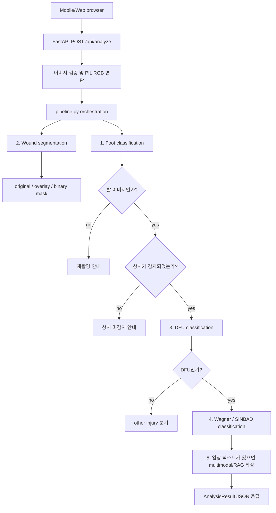

# DFU Project

## 1. 프로젝트 목표

DFU Project는 당뇨병성 족부궤양(Diabetic Foot Ulcer, DFU) 환자가 휴대폰으로 발 또는 상처 이미지를 촬영/업로드하면, 이미지 기반 AI 분석과 선택적 임상 텍스트 입력을 결합해 상처 상태를 확인하는 모바일 우선 서비스다.

현재 1차 목표는 localhost에서 동작하는 웹 형태의 MVP를 완성하는 것이다. 이후 동일한 API/모델 어댑터 구조를 유지한 채 cloud 환경으로 배포할 수 있도록 구성한다.

## 2. 서비스 아키텍처

### 입력
- 이미지: 발 전체, 발 일부, 상처 근접 이미지
- 선택 텍스트: glucose, HbA1c, 메모 등 임상/생활 로그성 데이터

### 추론 흐름

```mermaid
flowchart TD
  A["Mobile/Web browser"] --> B["FastAPI POST /api/analyze"]
  B --> C["이미지 검증 및 PIL RGB 변환"]
  C --> D["pipeline.py orchestration"]
  D --> E["1. Foot classification"]
  D --> F["2. Wound segmentation"]
  F --> G["original / overlay / binary mask"]
  E --> H{"발 이미지인가?"}
  H -->|no| I["재촬영 안내"]
  H -->|yes| J{"상처가 감지되었는가?"}
  J -->|no| K["상처 미감지 안내"]
  J -->|yes| L["3. DFU classification"]
  L --> M{"DFU인가?"}
  M -->|no| N["other injury 분기"]
  M -->|yes| O["4. Wagner / SINBAD classification"]
  O --> P["5. 임상 텍스트가 있으면 multimodal/RAG 확장"]
  P --> Q["AnalysisResult JSON 응답"]
```

### 핵심 기능
1. Foot classification: 입력 이미지가 발 이미지인지 판단한다.
2. Wound segmentation: 상처 영역을 segmentation하고 original, overlay, binary mask를 반환한다.
3. DFU classification: 상처가 DFU인지 other injury인지 판단한다.
4. Wagner/SINBAD classification: DFU로 판단된 상처의 grade/score를 분류한다.
5. Multimodal 확장: glucose, HbA1c, 메모 등 텍스트 입력과 이미지 분석 결과를 결합해 grade/score 또는 위험도를 보정한다.

## 3. 현재 MVP1 웹 서비스

현재 서비스 앱은 `mvp1_classification` 폴더에 있다. FastAPI 서버가 API와 정적 웹 화면을 함께 제공한다. 초기 형태는 단일 `/api/analyze` 파이프라인 중심이었지만, 현재는 모델별 결과를 독립적으로 비교할 수 있는 workbench 형태로 확장되었다.

### 실행
```powershell
cd mvp1_classification
pip install -r requirements.txt
uvicorn app.main:app --host 0.0.0.0 --port 8000
```

브라우저에서 `http://localhost:8000`으로 접속한다.

### API
- `GET /`: 모바일 웹 화면 반환
- `GET /health`: 서버 상태 확인
- `GET /api/models`: 모델 비교 UI에서 사용할 모델 카탈로그 반환
- `POST /api/models/{model_id}/run`: 개별 모델 버튼 실행. 모델별 결과, timing/FPS, 좌표, raw output 등을 반환
- `POST /api/analyze`: 이미지와 선택 임상 입력을 받아 전체 DFU 분석 파이프라인 실행
- `POST /classify`: 과거 MVP 호환용 단일 classification endpoint

### 현재 웹 화면 동작
- 업로드한 동일 이미지에 대해 모델 버튼을 각각 눌러 결과를 비교한다.
- 모델 결과 카드에는 최소한 다음 항목을 포함한다.
  - 추론 결과: 예) `foot`, `dfu`, `other_injury`, `wound detected`
  - 추론 시간(ms), FPS
  - segmentation 기반 bounding box 좌표와 중심 좌표
  - raw output/debug 값
  - 평가 지표 슬롯: DICE, F1, Precision, Recall
- 현재 DICE/F1/Precision/Recall은 단일 추론 모드에서는 ground truth가 없으므로 `N/A`로 반환한다. 실제 수치는 GT 마스크/정답 라벨이 함께 주어지는 평가 경로에서 계산한다.

## 4. 폴더와 파일 역할

### 서비스 앱: `mvp1_classification`
- `app/main.py`: FastAPI 엔트리포인트. 정적 파일, `/health`, `/classify`, `/api/analyze`, `/api/models`, `/api/models/{model_id}/run` 라우팅과 업로드 이미지 검증을 담당한다.
- `app/schemas.py`: API 응답 스키마. 기존 pipeline 응답뿐 아니라 model catalog, model run result, timing, detection, eval metric, raw output 계약을 정의한다.
- `app/settings.py`: 모델 경로, label, backend, threshold, CORS 등 환경변수 기본값을 관리한다.
- `app/model.py`: 과거 `/classify` 호환용 wrapper. 실제 classifier 호출은 `app/services/classifier.py`로 위임한다.
- `app/services/pipeline.py`: foot classification, segmentation, DFU classification, Wagner/SINBAD classification 흐름을 제어한다.
- `app/services/classifier.py`: task별 classifier adapter. `foot`, `dfu`, `wagner`, `sinbad`, `legacy` task를 동일한 인터페이스로 호출하며, 필요한 경우 shared feature context를 넘길 수 있다.
- `app/services/segmentation.py`: wound segmentation adapter. `demo`, `swin_m2f`, `dino_m2f`, `custom_head` backend를 선택할 수 있고, mask 기반 bounding box 계산도 담당한다.
- `app/services/pca_focus.py`: DINOv3 backbone patch token을 이용한 PCA/cosine visualization을 담당한다.
- `app/services/dinov3_loader.py`: 로컬 DINOv3 원본 코드와 backbone `.pth`를 직접 읽어 ViT-B/16 backbone을 생성한다.
- `app/services/feature_store.py`: 업로드 이미지 해시를 기준으로 DINO feature context를 캐시한다. 모델 비교 버튼 여러 개를 눌러도 공통 feature를 재사용하는 경로다.
- `app/services/model_catalog.py`: 비교 가능한 모델 목록과 메타데이터를 정의한다.
- `app/services/model_runner.py`: 모델별 실행 entry. 추론 결과, 시간, FPS, bbox, raw output, artifact, feature cache 상태를 모아 반환한다.
- `app/image_utils.py`: PIL 이미지를 브라우저에서 표시 가능한 base64 data URL로 변환한다.
- `app/static/index.html`: 모델 비교 workbench 화면.
- `app/static/styles.css`: 비교 카드, artifact grid, detection/eval metric 섹션을 포함한 반응형 UI 스타일.
- `app/static/app.js`: 이미지 미리보기, 모델 카탈로그 로드, 개별 모델 실행, 결과 비교 카드 렌더링을 담당한다.
- `requirements.txt`: 로컬 MVP 실행에 필요한 Python 패키지.

### 학습/실험: `Model_training`
- `Model_training/configs/custom/dino_v3_mask2former_wound_instance.yaml`: DINOv3 + Mask2Former wound segmentation config.
- `Model_training/configs/custom/wound_instance_swinb.yaml`: Swin + Mask2Former 계열 segmentation config.
- `Model_training/docs/`: Colab/Kaggle/로컬 학습 가이드.
- `Model_training/notebooks/kaggle_training_dino_m2f.ipynb`: Kaggle 기반 학습 notebook.
- `Model_training/tools/`: dataset 변환 등 보조 스크립트.
- `Model_training/train_net.py`, `Model_training/train_net_freeze.py`: 학습 실행 코드.

### 외부 clone reference
아래 폴더는 GitHub에서 clone한 upstream/reference 코드이며 직접 서비스 코드로 취급하지 않는다.
- `dinov3/`: DINOv3 backbone 원본 reference.
- `DINOv3-Mask2Former/` 또는 `DINOv3-Mask2former/`: DINOv3와 Mask2Former 결합 실험 reference.
- `Mask2formers/`: Mask2Former 원본/참고 구현.

서비스에 필요한 코드는 가능하면 `mvp1_classification/app/services` 아래 adapter로 흡수한다. upstream 폴더를 직접 import하면 배포와 의존성 관리가 어려워지므로, 필요한 부분만 명시적으로 adapter화한다.

### 오케스트레이션 문서
- `orchestration/ORCHESTRATION.md`: sub-agent 또는 작업 분기 운영 규칙.
- `orchestration/agent_registry.yaml`: agent 역할 매핑.
- `orchestration/decision_log.md`: 주요 결정 기록.

## 5. 모델 파라미터 위치

대용량 모델 weight는 Git에 올리지 않고 `parameters/` 아래에 둔다. `parameters/`는 로컬/배포 환경에서 별도로 준비하는 영역으로 취급한다.

권장 구조:
```text
parameters/
  DINOv3_pth/
    dinov3_vitb16_pretrain_lvd1689m-73cec8be.pth
  segmentation/
    fastinst_d3/
      config.yaml
      model_final.pth
    dino_m2f/
      config.yaml
      model_final.pth
  classification/
    foot/
      model.pt
    dfu/
      model.pt
    wagner/
      model.pt
    sinbad/
      model.pt
  app_models/
    legacy_classifier.pt
```

현재 backbone PCA와 공통 feature backbone 경로는 아래 파일을 기본 사용한다.
- `parameters/DINOv3_pth/dinov3_vitb16_pretrain_lvd1689m-73cec8be.pth`

기본 경로는 `app/settings.py`에 정의되어 있다. 폴더를 바꾸고 싶으면 `DFU_PARAMETERS_DIR` 또는 task별 환경변수를 사용한다.

관련 핵심 경로:
- `DINO_WEIGHTS_PATH`: DINOv3 backbone PCA/공통 feature backbone
- `DINO_M2F_CONFIG_PATH`, `DINO_M2F_WEIGHTS_PATH`: DINOv3 segmentation 계열
- `FOOT_MODEL_PATH`, `DFU_MODEL_PATH`, `WAGNER_MODEL_PATH`, `SINBAD_MODEL_PATH`: classifier head 계열

## 6. 모델 교체 방법

### 모델 없이 MVP 화면/API 실행
학습 weight가 아직 없을 때는 기본값으로 동작한다.

```powershell
$env:CLASSIFIER_BACKEND = "dummy"
$env:SEG_DEFAULT_BACKEND = "demo"
uvicorn app.main:app --host 0.0.0.0 --port 8000
```

이 모드에서는 웹 화면과 API 응답 계약을 검증할 수 있지만, 의료적으로 의미 있는 결과는 아니다.

### DINOv3 + Mask2Former segmentation weight 사용
```powershell
$env:SEG_DEFAULT_BACKEND = "dino_m2f"
$env:DINO_M2F_CONFIG_PATH = "C:\path\to\Model_training\configs\custom\dino_v3_mask2former_wound_instance.yaml"
$env:DINO_M2F_WEIGHTS_PATH = "C:\path\to\parameters\Fine-tuned_pth\wound_dino_m2f\model_final.pth"
$env:DINO_WEIGHTS_PATH = "C:\path\to\parameters\DINOv3_pth\dinov3_vitb16_pretrain_lvd1689m-73cec8be.pth"
```

### task별 classifier weight 사용
```powershell
$env:CLASSIFIER_BACKEND = "custom"
$env:CUSTOM_CLASSIFIER = "your_module:YourClassifier"
$env:FOOT_MODEL_PATH = "C:\path\to\parameters\app_models\foot_classifier.pt"
$env:DFU_MODEL_PATH = "C:\path\to\parameters\app_models\dfu_classifier.pt"
$env:WAGNER_MODEL_PATH = "C:\path\to\parameters\app_models\wagner_classifier.pt"
$env:SINBAD_MODEL_PATH = "C:\path\to\parameters\app_models\sinbad_classifier.pt"
```

`CUSTOM_CLASSIFIER`의 class는 `app.services.classifier.BaseClassifier`와 같은 형태로 `load()`와 `predict(image) -> tuple[int, float]`를 구현하면 된다. 이렇게 하면 API와 프론트엔드는 수정하지 않고 모델만 교체할 수 있다.

### custom segmentation adapter 사용
```powershell
$env:SEG_DEFAULT_BACKEND = "custom_head"
$env:CUSTOM_SEGMENTER = "your_module:YourSegmenter"
```

`YourSegmenter.predict(image)`는 `(mask, area_ratio, wound_present)`를 반환해야 한다.

## 7. 수정/확장 원칙

- API 응답 계약은 `app/schemas.py`를 기준으로 관리한다.
- 새 classification task는 `app/services/classifier.py`의 `TASKS`에 추가하고 `pipeline.py`에서 호출 순서를 정의한다.
- 새 segmentation backend는 `app/services/segmentation.py`의 `_BACKEND_FACTORIES`에 adapter를 추가한다.
- 모델 경로, threshold, label은 코드에 하드코딩하지 않고 `app/settings.py`와 환경변수로 관리한다.
- 프론트엔드는 `/api/analyze` 응답만 바라보게 유지한다. 모델 내부 구현이 바뀌어도 화면 코드는 최소 수정으로 유지되어야 한다.
- upstream clone 폴더는 reference로만 사용한다. 서비스 런타임에 직접 의존해야 한다면 별도 adapter와 requirements 정리가 필요하다.
- 의료/진단 문구는 연구/개발용 disclaimer를 유지한다. 실제 임상 사용 전에는 규제, 보안, 로그, 개인정보 정책을 별도로 확정해야 한다.

## 8. Cloud 배포 준비 메모

cloud 배포 전 결정해야 할 항목:
- weight 제공 방식: container image 포함, object storage 다운로드, persistent volume mount 중 선택
- GPU 필요 여부: DINOv3/Mask2Former 실시간 추론이면 GPU 환경 또는 경량화가 필요할 수 있다.
- 모델 warm-up: 첫 요청 latency를 줄이기 위해 startup 시 모델 load를 고려한다.
- 업로드 제한: 이미지 크기, 파일 타입, 요청 timeout, 임시 파일 정책을 명시한다.
- 보안: CORS, 인증, HTTPS, PHI/PII 저장 여부, 로그 마스킹 정책을 확정한다.
- 관측성: request_id, model version, weight path/hash, inference latency를 기록한다.

## 9. 현재 상태

- `mvp1_classification`은 localhost 실행 가능한 API + 모델 비교 웹 화면 구조를 갖춘 상태다.
- 개별 모델 버튼은 다음 항목을 분리해 비교할 수 있다.
  - DINOv3 Backbone PCA
  - DINOv3 segmentation 경로
  - Foot / Non-foot
  - DFU / Other injury
  - Wagner
  - SINBAD
- shared feature cache가 도입되어 같은 이미지에 대해 여러 모델 버튼을 눌러도 공통 DINO feature context를 재사용한다.
- 현재 `feature_backend`는 실제 `dinov3_vitb16`로 동작한다. 즉 image patch fallback이 아니라 로컬 DINOv3 원본 backbone + `dinov3_vitb16_pretrain_lvd1689m-73cec8be.pth` 기반 feature를 사용한다.
- `dinov3_linear_foot`와 `dinov3_linear_sinbad`는 실행 검증을 마쳤고, 공통 feature backend가 `dinov3_vitb16`로 표기되는 것을 확인했다.
- segmentation 결과 카드에는 wound detection 여부, area ratio, bbox 좌표, 중심 좌표, timing/FPS가 포함된다.
- 분류 결과 카드에는 최종 class label, confidence, timing/FPS, feature cache hit/miss, raw output이 포함된다.
- DICE/F1/Precision/Recall은 현재 inference-only 경로에서는 GT가 없으므로 `N/A`로 남겨두고, 추후 평가용 endpoint 또는 dataset 기반 batch evaluator에서 실제 수치를 계산하도록 설계했다.
