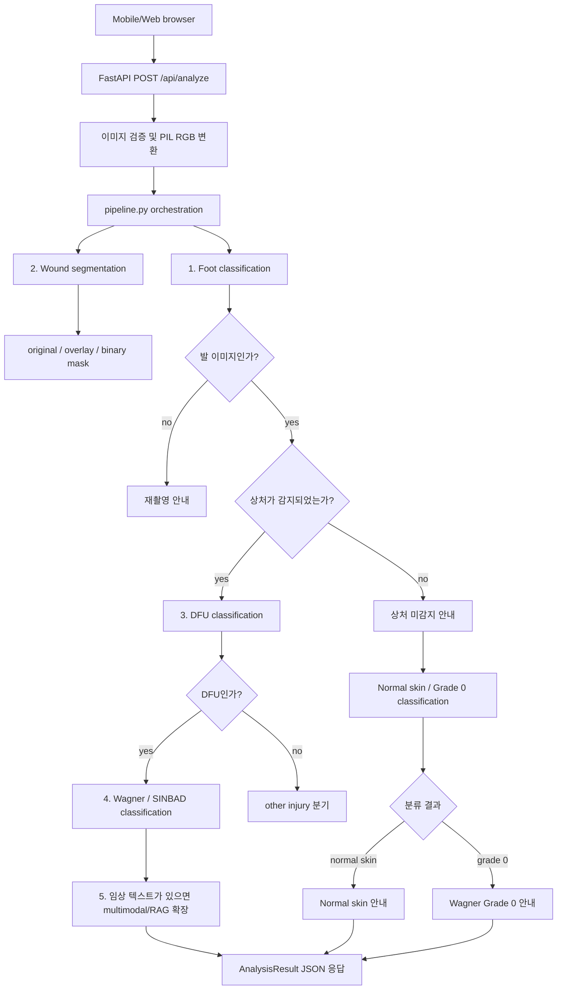
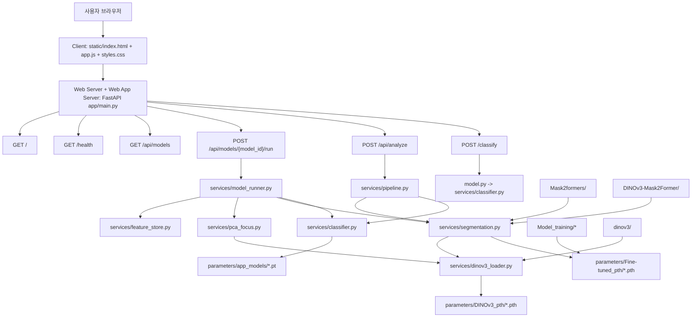

# DFU Project

## 1. 목적

이 프로젝트는 당뇨병성 족부궤양(Diabetic Foot Ulcer, DFU) 이미지를 입력받아 다음 작업을 수행하는 로컬 MVP를 만드는 것이 목적이다.

- 발 이미지 여부 판별
- 상처 영역 세그멘테이션
- DFU 여부 분류
- Wagner / SINBAD 분류
- 향후 임상 텍스트 입력을 결합한 멀티모달 확장

현재 기준 서비스 중심 폴더는 `mvp1_classification` 이다. 이 폴더가 실제 웹앱, API, 모델 실행 어댑터의 진입점이다.

## 2. 전체 구조 한눈에 보기

### 입력

- 이미지: 발 전체, 발 일부, 상처 근접 이미지
- 선택 텍스트: glucose, HbA1c, 메모 등 임상/생활 로그성 데이터

### 추론 흐름


```mermaid
flowchart TD
  A["Mobile/Web browser"] --> B["FastAPI POST /api/analyze"]
  B --> C["이미지 검증 및 PIL RGB 변환"]
  C --> D["pipeline.py orchestration"]
  D --> E["1. Foot classification"]
  D --> F["2. Wound segmentation"]
  F --> G["original / overlay / binary mask"]
  E --> H{"발 이미지인가?"}
  H -->|no| I["재촬영 안내"]
  H -->|yes| J{"상처가 감지되었는가?"}

  J -->|no| K["상처 미감지 안내"]
  K --> K1["Normal skin / Grade 0 classification"]
  K1 --> K2{"분류 결과"}
  K2 -->|normal skin| K3["Normal skin 안내"]
  K2 -->|grade 0| K4["Wagner Grade 0 안내"]

  J -->|yes| L["3. DFU classification"]
  L --> M{"DFU인가?"}
  M -->|no| N["other injury 분기"]
  M -->|yes| O["4. Wagner / SINBAD classification"]
  O --> P["5. 임상 텍스트가 있으면 multimodal/RAG 확장"]
  P --> Q["AnalysisResult JSON 응답"]

  K3 --> Q
  K4 --> Q
```

### 시스템 구조


```mermaid
flowchart TD
  U["사용자 브라우저"] --> C["Client: static/index.html + app.js + styles.css"]
  C --> S["Web Server + Web App Server: FastAPI app/main.py"]
  S --> API1["GET /"]
  S --> API2["GET /health"]
  S --> API3["GET /api/models"]
  S --> API4["POST /api/models/{model_id}/run"]
  S --> API5["POST /api/analyze"]
  S --> API6["POST /classify"]

  API4 --> MR["services/model_runner.py"]
  API5 --> PL["services/pipeline.py"]
  API6 --> LG["model.py -> services/classifier.py"]

  MR --> FS["services/feature_store.py"]
  MR --> PCA["services/pca_focus.py"]
  MR --> SEG["services/segmentation.py"]
  MR --> CLS["services/classifier.py"]

  PL --> SEG
  PL --> CLS

  SEG --> DINO["services/dinov3_loader.py"]
  PCA --> DINO
  DINO --> W1["parameters/DINOv3_pth/*.pth"]
  SEG --> W2["parameters/Fine-tuned_pth/*.pth"]
  CLS --> W3["parameters/app_models/*.pt"]

  T["Model_training/*"] --> W2
  R1["dinov3/"] --> DINO
  R2["Mask2formers/"] --> SEG
  R3["DINOv3-Mask2Former/"] --> SEG
```

## 3. 현재 구성 요소

### 3.1 DB

현재 별도 DB는 없다.

- RDBMS 없음
- NoSQL 없음
- 벡터 DB 없음
- 세션 저장소 없음
- 결과 영속 저장 없음

현재 상태 관리는 메모리와 파일 기반이다.

- 업로드 이미지는 요청 단위로만 처리된다.
- 공통 feature cache는 [feature_store.py](/C:/Users/RexSoft/Desktop/Project/당뇨발과제/PM업무_송모세/1st_mvp/mvp1_classification/app/services/feature_store.py:1) 에서 프로세스 메모리 LRU 형태로 유지된다.
- 모델 weight는 `parameters/` 폴더에서 파일로 읽는다.

### 3.2 서버

현재 서버는 하나의 FastAPI 프로세스가 두 역할을 동시에 수행한다.

- 웹서버 역할: 정적 HTML/CSS/JS 서빙
- 웹앱서버 역할: API 라우팅, 이미지 검증, 파이프라인 실행, 모델 실행

실행 진입점:

- [app/main.py](/C:/Users/RexSoft/Desktop/Project/당뇨발과제/PM업무_송모세/1st_mvp/mvp1_classification/app/main.py:1)
- 실행 명령: `uvicorn app.main:app --host 0.0.0.0 --port 8000`

현재 별도 리버스 프록시(Nginx, Apache)나 별도 WAS 계층은 없다.

### 3.3 API

현재 API는 FastAPI 한 곳에 정의되어 있다.

| Method | Path | 역할 | 실행 파일 |
|---|---|---|---|
| `GET` | `/` | 메인 웹 화면 반환 | [app/main.py](/C:/Users/RexSoft/Desktop/Project/당뇨발과제/PM업무_송모세/1st_mvp/mvp1_classification/app/main.py:50) |
| `GET` | `/health` | 서버 상태 확인 | [app/main.py](/C:/Users/RexSoft/Desktop/Project/당뇨발과제/PM업무_송모세/1st_mvp/mvp1_classification/app/main.py:55) |
| `GET` | `/api/models` | 모델 비교용 카탈로그 반환 | [app/main.py](/C:/Users/RexSoft/Desktop/Project/당뇨발과제/PM업무_송모세/1st_mvp/mvp1_classification/app/main.py:60) |
| `POST` | `/api/models/{model_id}/run` | 개별 모델 단위 실행 | [app/main.py](/C:/Users/RexSoft/Desktop/Project/당뇨발과제/PM업무_송모세/1st_mvp/mvp1_classification/app/main.py:101) |
| `POST` | `/api/analyze` | 전체 DFU 파이프라인 실행 | [app/main.py](/C:/Users/RexSoft/Desktop/Project/당뇨발과제/PM업무_송모세/1st_mvp/mvp1_classification/app/main.py:82) |
| `POST` | `/classify` | 구형 단일 분류 호환 API | [app/main.py](/C:/Users/RexSoft/Desktop/Project/당뇨발과제/PM업무_송모세/1st_mvp/mvp1_classification/app/main.py:65) |

### 3.4 Client

현재 클라이언트는 서버가 함께 제공하는 정적 웹앱이다.

- 화면 템플릿: [index.html](/C:/Users/RexSoft/Desktop/Project/당뇨발과제/PM업무_송모세/1st_mvp/mvp1_classification/app/static/index.html:1)
- 동작 스크립트: [app.js](/C:/Users/RexSoft/Desktop/Project/당뇨발과제/PM업무_송모세/1st_mvp/mvp1_classification/app/static/app.js:1)
- 스타일: [styles.css](/C:/Users/RexSoft/Desktop/Project/당뇨발과제/PM업무_송모세/1st_mvp/mvp1_classification/app/static/styles.css:1)

클라이언트가 하는 일:

- 이미지 파일 선택
- `/health` 로 서버 상태 확인
- `/api/models` 로 버튼 목록 로드
- `/api/models/{model_id}/run` 으로 모델별 비교 실행
- `/api/analyze` 로 전체 파이프라인 실행
- 결과 카드, metric, artifact 이미지 렌더링

현재 별도 모바일 앱, React SPA, Next.js 프런트엔드, Electron 클라이언트는 없다.

## 4. 서비스 코드 구조

### 4.1 핵심 앱 폴더

`mvp1_classification/app`

| 파일 | 역할 |
|---|---|
| [main.py](/C:/Users/RexSoft/Desktop/Project/당뇨발과제/PM업무_송모세/1st_mvp/mvp1_classification/app/main.py:1) | FastAPI 엔트리포인트, 라우팅, 업로드 이미지 검증 |
| [schemas.py](/C:/Users/RexSoft/Desktop/Project/당뇨발과제/PM업무_송모세/1st_mvp/mvp1_classification/app/schemas.py:1) | API 요청/응답 스키마 |
| [settings.py](/C:/Users/RexSoft/Desktop/Project/당뇨발과제/PM업무_송모세/1st_mvp/mvp1_classification/app/settings.py:1) | 모델 경로, backend, threshold, CORS 등 설정 |
| [model.py](/C:/Users/RexSoft/Desktop/Project/당뇨발과제/PM업무_송모세/1st_mvp/mvp1_classification/app/model.py:1) | 구형 `/classify` 호환 래퍼 |
| [image_utils.py](/C:/Users/RexSoft/Desktop/Project/당뇨발과제/PM업무_송모세/1st_mvp/mvp1_classification/app/image_utils.py:1) | PIL 이미지 변환, overlay/base64 유틸 |

### 4.2 서비스 레이어

`mvp1_classification/app/services`

| 파일 | 역할 |
|---|---|
| [pipeline.py](/C:/Users/RexSoft/Desktop/Project/당뇨발과제/PM업무_송모세/1st_mvp/mvp1_classification/app/services/pipeline.py:1) | 전체 DFU 분석 흐름 제어 |
| [classifier.py](/C:/Users/RexSoft/Desktop/Project/당뇨발과제/PM업무_송모세/1st_mvp/mvp1_classification/app/services/classifier.py:1) | 분류기 adapter 계층 |
| [segmentation.py](/C:/Users/RexSoft/Desktop/Project/당뇨발과제/PM업무_송모세/1st_mvp/mvp1_classification/app/services/segmentation.py:1) | 세그멘테이션 adapter 계층 |
| [model_catalog.py](/C:/Users/RexSoft/Desktop/Project/당뇨발과제/PM업무_송모세/1st_mvp/mvp1_classification/app/services/model_catalog.py:1) | 비교 가능한 모델 목록 정의 |
| [model_runner.py](/C:/Users/RexSoft/Desktop/Project/당뇨발과제/PM업무_송모세/1st_mvp/mvp1_classification/app/services/model_runner.py:1) | 모델별 단건 실행과 결과 카드 생성 |
| [feature_store.py](/C:/Users/RexSoft/Desktop/Project/당뇨발과제/PM업무_송모세/1st_mvp/mvp1_classification/app/services/feature_store.py:1) | 공통 feature cache |
| [pca_focus.py](/C:/Users/RexSoft/Desktop/Project/당뇨발과제/PM업무_송모세/1st_mvp/mvp1_classification/app/services/pca_focus.py:1) | DINOv3 feature 시각화 |
| [dinov3_loader.py](/C:/Users/RexSoft/Desktop/Project/당뇨발과제/PM업무_송모세/1st_mvp/mvp1_classification/app/services/dinov3_loader.py:1) | 로컬 DINOv3 backbone 로더 |

## 5. 모델 종류와 실행 파일

### 5.1 현재 비교 가능한 모델 목록

현재 모델 카탈로그는 [model_catalog.py](/C:/Users/RexSoft/Desktop/Project/당뇨발과제/PM업무_송모세/1st_mvp/mvp1_classification/app/services/model_catalog.py:32) 에 정의되어 있다.

| 모델 ID | 종류 | 목적 | 직접 실행되는 파일 | 내부 의존 |
|---|---|---|---|---|
| `dinov3_backbone_pca` | 시각화 모델 | DINOv3 patch feature 시각화 | [model_runner.py](/C:/Users/RexSoft/Desktop/Project/당뇨발과제/PM업무_송모세/1st_mvp/mvp1_classification/app/services/model_runner.py:72) | `pca_focus.py`, `feature_store.py`, `dinov3_loader.py` |
| `dinov3_fastinst_d3_segmentation` | 세그멘테이션 모델 | 상처 영역 mask 생성 | [model_runner.py](/C:/Users/RexSoft/Desktop/Project/당뇨발과제/PM업무_송모세/1st_mvp/mvp1_classification/app/services/model_runner.py:111) | `segmentation.py`, `feature_store.py` |
| `dinov3_linear_foot` | 분류 모델 | Foot / Non-foot 판별 | [model_runner.py](/C:/Users/RexSoft/Desktop/Project/당뇨발과제/PM업무_송모세/1st_mvp/mvp1_classification/app/services/model_runner.py:190) | `classifier.py`, `feature_store.py` |
| `dinov3_linear_dfu` | 분류 모델 | DFU / Other injury 판별 | [model_runner.py](/C:/Users/RexSoft/Desktop/Project/당뇨발과제/PM업무_송모세/1st_mvp/mvp1_classification/app/services/model_runner.py:190) | `classifier.py`, `feature_store.py` |
| `dinov3_linear_wagner` | 분류 모델 | Wagner 등급 분류 | [model_runner.py](/C:/Users/RexSoft/Desktop/Project/당뇨발과제/PM업무_송모세/1st_mvp/mvp1_classification/app/services/model_runner.py:190) | `classifier.py`, `feature_store.py` |
| `dinov3_linear_sinbad` | 분류 모델 | SINBAD 관련 분류 | [model_runner.py](/C:/Users/RexSoft/Desktop/Project/당뇨발과제/PM업무_송모세/1st_mvp/mvp1_classification/app/services/model_runner.py:190) | `classifier.py`, `feature_store.py` |

### 5.2 모델별 실제 실행 경로

#### A. 전체 파이프라인 실행

엔드포인트:

- `POST /api/analyze`

실행 순서:

1. [main.py](/C:/Users/RexSoft/Desktop/Project/당뇨발과제/PM업무_송모세/1st_mvp/mvp1_classification/app/main.py:82) 에서 이미지 입력 수신
2. [pipeline.py](/C:/Users/RexSoft/Desktop/Project/당뇨발과제/PM업무_송모세/1st_mvp/mvp1_classification/app/services/pipeline.py:30) 의 `analyze_image(...)` 호출
3. [classifier.py](/C:/Users/RexSoft/Desktop/Project/당뇨발과제/PM업무_송모세/1st_mvp/mvp1_classification/app/services/classifier.py:177) 로 `foot` 분류
4. [segmentation.py](/C:/Users/RexSoft/Desktop/Project/당뇨발과제/PM업무_송모세/1st_mvp/mvp1_classification/app/services/segmentation.py:302) 로 세그멘테이션 backend 선택
5. 상처가 있으면 `dfu`, `wagner`, `sinbad` 순으로 추가 분류
6. [schemas.py](/C:/Users/RexSoft/Desktop/Project/당뇨발과제/PM업무_송모세/1st_mvp/mvp1_classification/app/schemas.py:1) 형태로 응답 반환

#### B. 개별 모델 비교 실행

엔드포인트:

- `POST /api/models/{model_id}/run`

실행 순서:

1. [main.py](/C:/Users/RexSoft/Desktop/Project/당뇨발과제/PM업무_송모세/1st_mvp/mvp1_classification/app/main.py:101) 에서 `model_id` 수신
2. [model_catalog.py](/C:/Users/RexSoft/Desktop/Project/당뇨발과제/PM업무_송모세/1st_mvp/mvp1_classification/app/services/model_catalog.py:95) 로 모델 정의 확인
3. [model_runner.py](/C:/Users/RexSoft/Desktop/Project/당뇨발과제/PM업무_송모세/1st_mvp/mvp1_classification/app/services/model_runner.py:76) 의 `run_model(...)` 실행
4. 공통 feature가 필요하면 [feature_store.py](/C:/Users/RexSoft/Desktop/Project/당뇨발과제/PM업무_송모세/1st_mvp/mvp1_classification/app/services/feature_store.py:84) 에서 캐시 사용
5. 모델 종류에 따라 `pca_focus.py`, `segmentation.py`, `classifier.py` 중 하나로 분기

#### C. 구형 단일 분류 실행

엔드포인트:

- `POST /classify`

실행 순서:

1. [main.py](/C:/Users/RexSoft/Desktop/Project/당뇨발과제/PM업무_송모세/1st_mvp/mvp1_classification/app/main.py:65) 에서 요청 수신
2. [model.py](/C:/Users/RexSoft/Desktop/Project/당뇨발과제/PM업무_송모세/1st_mvp/mvp1_classification/app/model.py:1) 경유
3. [classifier.py](/C:/Users/RexSoft/Desktop/Project/당뇨발과제/PM업무_송모세/1st_mvp/mvp1_classification/app/services/classifier.py:150) 의 legacy task 실행

## 6. 모델 backend와 현재 구현 상태

### 6.1 분류기 backend

[classifier.py](/C:/Users/RexSoft/Desktop/Project/당뇨발과제/PM업무_송모세/1st_mvp/mvp1_classification/app/services/classifier.py:150)

| backend | 상태 | 설명 |
|---|---|---|
| `dummy` | 구현 완료 | 기본값. 실제 학습 모델 없이 기본 class를 반환 |
| `custom` | 구현 완료 | 외부 사용자 정의 classifier class를 로드 |

현재 기본 설정:

- [settings.py](/C:/Users/RexSoft/Desktop/Project/당뇨발과제/PM업무_송모세/1st_mvp/mvp1_classification/app/settings.py:32) `CLASSIFIER_BACKEND = "dummy"`

즉, 분류 task 구조는 구현되어 있지만 기본 실행은 더미 응답이다. 실제 모델 추론을 하려면 `CUSTOM_CLASSIFIER` 와 task별 모델 경로를 연결해야 한다.

### 6.2 세그멘테이션 backend

[segmentation.py](/C:/Users/RexSoft/Desktop/Project/당뇨발과제/PM업무_송모세/1st_mvp/mvp1_classification/app/services/segmentation.py:294)

| backend | 상태 | 설명 |
|---|---|---|
| `demo` | 구현 완료 | 기본값. 색상 기반 휴리스틱 mask 생성 |
| `swin_m2f` | 구현 완료 | Detectron2 + Mask2Former 기반 |
| `dino_m2f` | 구현 완료 | DINOv3 backbone + Mask2Former 기반 |
| `custom_head` | 구현 완료 | 외부 사용자 정의 segmenter 연결 |

현재 기본 설정:

- [settings.py](/C:/Users/RexSoft/Desktop/Project/당뇨발과제/PM업무_송모세/1st_mvp/mvp1_classification/app/settings.py:53) `SEG_DEFAULT_BACKEND = "demo"`

즉, 세그멘테이션 adapter 구조는 구현되어 있지만 기본 실행은 데모 mask다.

### 6.3 DINOv3 feature / PCA 시각화

이 부분은 실제 로컬 weight를 읽는 구조가 구현되어 있다.

- backbone 로더: [dinov3_loader.py](/C:/Users/RexSoft/Desktop/Project/당뇨발과제/PM업무_송모세/1st_mvp/mvp1_classification/app/services/dinov3_loader.py:1)
- PCA 시각화: [pca_focus.py](/C:/Users/RexSoft/Desktop/Project/당뇨발과제/PM업무_송모세/1st_mvp/mvp1_classification/app/services/pca_focus.py:20)
- feature cache: [feature_store.py](/C:/Users/RexSoft/Desktop/Project/당뇨발과제/PM업무_송모세/1st_mvp/mvp1_classification/app/services/feature_store.py:13)

`DinoPcaVisualizer` 가 실패하면 `ImagePatchFallbackVisualizer` 로 폴백한다.

## 7. 모델 weight와 관련 폴더

### 7.1 현재 저장소 내 weight 성격

| 폴더 | 용도 | 현재 상태 |
|---|---|---|
| `parameters/DINOv3_pth` | DINOv3 backbone pretrained weight | 파일 존재 |
| `parameters/Fine-tuned_pth` | 세그멘테이션 fine-tuned weight | 일부 파일 존재 |
| `parameters/Mask2Formers_pth` | Mask2Former 계열 pretrained/reference weight | 파일 존재 |
| `parameters/app_models` | 서비스 분류 head weight | 현재 없음 |

### 7.2 설정 파일

모델 경로와 backend 설정은 [settings.py](/C:/Users/RexSoft/Desktop/Project/당뇨발과제/PM업무_송모세/1st_mvp/mvp1_classification/app/settings.py:1) 에 모여 있다.

주요 환경변수:

- `CLASSIFIER_BACKEND`
- `CUSTOM_CLASSIFIER`
- `FOOT_MODEL_PATH`
- `DFU_MODEL_PATH`
- `WAGNER_MODEL_PATH`
- `SINBAD_MODEL_PATH`
- `SEG_DEFAULT_BACKEND`
- `SEG_CONFIG_PATH`
- `SEG_WEIGHTS_PATH`
- `DINO_WEIGHTS_PATH`
- `DINO_M2F_CONFIG_PATH`
- `DINO_M2F_WEIGHTS_PATH`

## 8. 학습 코드와 참고 코드

### 8.1 학습 코드

`Model_training` 폴더는 서비스 런타임이 아니라 학습과 실험용이다.

| 파일/폴더 | 역할 |
|---|---|
| [train_net.py](/C:/Users/RexSoft/Desktop/Project/당뇨발과제/PM업무_송모세/1st_mvp/Model_training/train_net.py:1) | Detectron2 계열 학습 실행 |
| [train_net_freeze.py](/C:/Users/RexSoft/Desktop/Project/당뇨발과제/PM업무_송모세/1st_mvp/Model_training/train_net_freeze.py:1) | 일부 freezing 포함 학습 실행 |
| `configs/custom/*.yaml` | 세그멘테이션 학습 설정 |
| `tools/*` | 데이터셋 변환, 학습 보조 |
| `docs/*` | Colab, Kaggle, 로컬 학습 가이드 |
| `train_results/*` | 실험 산출물, 평가 결과 |

### 8.2 참고 코드

아래 폴더는 직접 서비스 엔트리포인트가 아니다.

- `dinov3/`: 원본 DINOv3 코드 reference
- `Mask2formers/`: 원본 Mask2Former reference
- `DINOv3-Mask2Former/`: 결합 실험 reference

현재 서비스 코드는 가능한 한 이 reference 폴더를 직접 쓰지 않고 adapter를 통해 필요한 부분만 흡수하는 방향이다.

## 9. 현재 구현 수준 요약

### 구현 완료

- FastAPI 기반 웹서버 + 웹앱서버 통합 구조
- 정적 웹 클라이언트
- 모델 비교용 카탈로그 API
- 모델 개별 실행 API
- 전체 DFU 파이프라인 API
- 분류기 adapter 구조
- 세그멘테이션 adapter 구조
- DINOv3 backbone feature 추출 및 PCA 시각화
- 메모리 기반 feature cache
- 학습용 config / training 코드 / 결과 폴더 정리

### 부분 완료

- DINOv3 기반 실제 feature 경로는 구현됨
- 세그멘테이션 실제 weight 연결은 환경변수/경로 정리가 필요함
- 분류 실제 head 연결은 `custom` backend 구현체와 weight 준비가 필요함
- SINBAD 는 현재 단일 결과 중심이며 세부 S/I/N/B/A/D 멀티라벨 헤드는 아직 보류 상태

### 미구현 또는 현재 없음

- DB
- 사용자 인증
- 결과 저장
- 멀티모달 RAG 파이프라인
- 클라우드 배포용 인프라
- 프로덕션용 reverse proxy / job queue / model serving 분리

## 10. 로컬 실행

```powershell
cd mvp1_classification
pip install -r requirements.txt
uvicorn app.main:app --host 0.0.0.0 --port 8000
```

접속 주소:

- `http://localhost:8000`

기본 실행 특징:

- 분류는 `dummy`
- 세그멘테이션은 `demo`
- 구조 검증과 UI 검증은 가능
- 의료적으로 유효한 실제 판독 결과로 간주하면 안 됨

## 11. 문서 유지 원칙

이 문서는 현재 코드 기준 아키텍처 문서다. `DFU_PROJECT.md` 와 `README.md` 는 동일한 내용을 유지한다.
