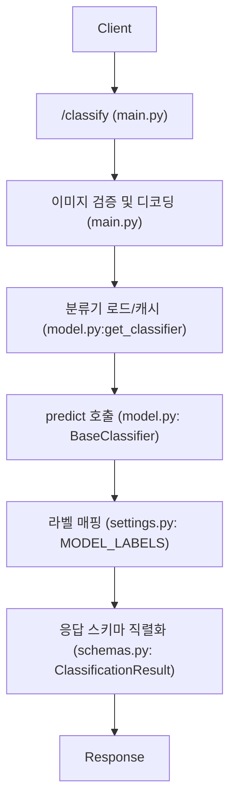

# DFU Project

## 프로젝트 개요
- **프로젝트 이름**: DFU project
- **목적**: 당뇨병발궤양(DFU) 환자가 집에서 **휴대폰으로 발을 촬영/업로드**(실시간 인식 또는 사진 업로드)하면, 아래 기능들을 제공하는 **당뇨병/당뇨병발궤양 플랫폼**을 만든다.

## 핵심 기능

### 기능 1) 상처 부위 Instance Segmentation
- 입력: 당뇨병발궤양 이미지(실시간 또는 업로드)
- 모델 구성:
  - **Backbone**: DINOv3
  - **Head**: Mask2Former
- 출력: 상처(병변) 부위를 **instance segmentation**한 마스크/결과

### 기능 2) 상처 부위 분류(Classification)
- 입력: 당뇨병발궤양 이미지
- 모델 구성:
  - **Backbone**: DINOv3
  - **Head**: Mask2Former
- 출력: 상처(병변) 수준의 **분류 결과**
  - 예: **SINBAD 점수 기반 분류** 또는 **Wagner class 기반 분류**

### 기능 3) 멀티모달 통합 + RAG 기반 위험도/확률 산출
- 추가 입력(예시):
  - 최근 3개월간 **HbA1c**
  - **Glucose** 수치
  - **건강검진 정보**
- 처리:
  - 이미지 결과(기능 1/2) + 추가 임상/건강 정보 → **멀티모달 데이터로 통합**
  - **RAG 기능 도입 예정**
- 출력(예시):
  - **사망률**
  - **당뇨병발궤양 유병확률**
  - **절단확률** 등 특정 지표 산출

## app 폴더 구성 (mvp1_classification/app)
- `main.py`: FastAPI 엔트리포인트. `/health`, `/classify` 라우트 제공, 업로드된 이미지 검증 후 분류 수행.
- `model.py`: 분류기 인터페이스 및 더미 분류기 구현. `get_classifier()`로 싱글턴 로드/캐시.
- `schemas.py`: API 응답 스키마(`ClassificationResult`) 정의.
- `settings.py`: 모델 경로/라벨/기본 클래스/HF 토큰 등 환경변수 설정 모음.
- `dino_mask2former.py`: timm DINOv3 백본에서 토큰을 피라미드 특징맵으로 변환하고 Mask2Former 입력 형태로 브릿지.
- `transformers_mask2former.py`: Transformers 기반 Mask2Former 추론 래퍼(공개 체크포인트 사용) + 후처리.
- `dino_mask2former_transformers.py`: DINOv3 백본을 Transformers Mask2Former에 교체 연결하는 커스텀 백본/추론 파이프라인.
- `__init__.py`: 패키지 마커(비어 있음).
## app 실행 흐름 (요청 -> 응답)

텍스트 흐름
- Client -> /classify (main.py)
- 이미지 검증 및 디코딩 (main.py)
- 분류기 로드/캐시 (model.py:get_classifier)
- predict 호출 (model.py: BaseClassifier)
- 라벨 매핑 (settings.py: MODEL_LABELS)
- 응답 스키마 직렬화 (schemas.py: ClassificationResult)
- Response

## Sub-Agents System
Purpose: sub-agents workflow for scalable development.

1. Orchestrator Agent
- Owns the global task state and priorities.
- Delegates work to other agents and resolves conflicts.
- Maintains shared decision logs and context snapshots.

2. Planning Agent
- Produces clear, staged plans and acceptance criteria.
- Identifies risks, unknowns, and dependency blockers.
- Keeps plans updated as tasks complete.

3. Model Agent (ViT/DINO/Mask2Former)
- Manages model import, loading, and inference pipelines.
- Owns preprocessing/postprocessing contracts.
- Provides model API adapters to keep swapability.

4. Feature/Service Agent
- Owns service-layer architecture and feature expansion.
- Designs extensible APIs and modular business logic.
- Ensures new features integrate cleanly without regressions.

5. Verification Agent
- Runs sandbox tests and validates runtime behavior.
- Performs static checks and targeted test cases.
- Reports failures with reproducible steps.

6. Deployment/Quantization Agent
- Handles quantization, optimization, and packaging.
- Produces final build artifacts and deployment configs.
- Owns release branching and rollout checks.

7. Frontend Agent
- Owns UI/UX implementation and iteration.
- Maintains design-system consistency and responsive layout.
- Integrates API responses into the UI.

## Shared Rules
- Keep API response schemas stable across agents.
- Document assumptions and changes in decision logs.
- Prefer small, reversible changes with clear ownership.

